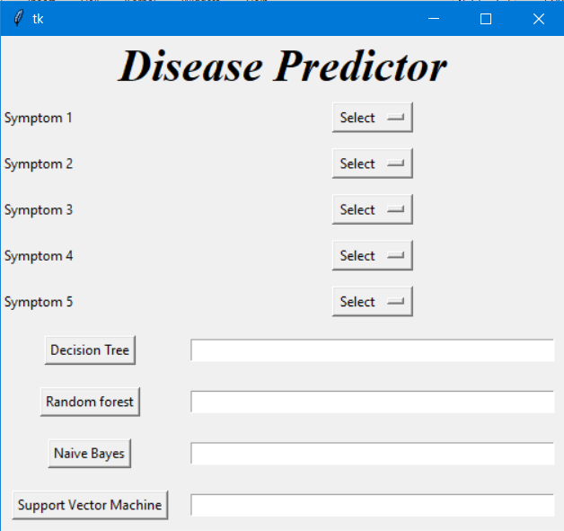
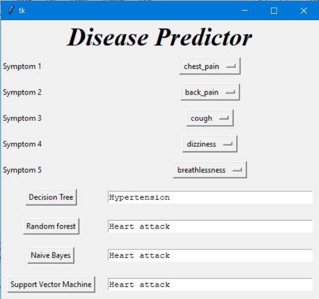

# 🔮 Disease Prediction using Machine Learning

This project utilizes advanced machine learning algorithms to predict diseases based on user-provided symptoms. It aims to provide accurate diagnostics and contribute to the advancement of healthcare technology. 

Explore our repository to learn more about this project and contribute to making healthcare diagnostics smarter!

  
      

---

## 🚀 Project Overview

This repository includes all the implementation code, dataset, and instructions required to train and evaluate the machine learning model. The goal is to predict diseases using machine learning techniques based on various input symptoms.

---

## 📊 Dataset

The dataset used for this project can be found [here on Kaggle](https://www.kaggle.com/datasets/kaushil268/disease-prediction-using-machine-learning/data).

| Column Name  | Description            |
| ------------ | ---------------------- |
| Symptom 1    | First symptom reported  |
| Symptom 2    | Second symptom reported |
| Disease      | Predicted disease label |

---

## 🛠 Getting Started

To begin contributing or exploring the project:

1. Clone this repository to your local machine.
2. Ensure you have Jupyter Notebook installed and running on your system.
3. Install the necessary dependencies by running pip install -r requirements.txt.
4. Download the "Disease Prediction Dataset" and place it in the designated directory within the project.
5. Open and execute the Jupyter Notebook "Disease-Prediction.ipynb" to train and evaluate the machine learning model.

# ⚙️ Algorithms Used
We explore and implement the following machine learning algorithms for disease prediction:

    -Random Forest
    -Decision Trees
    -K-Nearest Neighbors (KNN)
    -Logistic Regression
Each algorithm is evaluated on its performance, and the one with the highest accuracy is selected.

# 📜 License

This project is licensed under the MIT License - see the `LICENSE` file for details.

# ✍️ Author

Developed and maintained by Het Patel.

